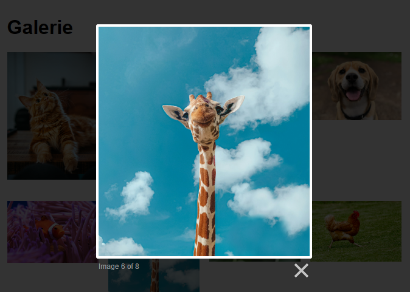
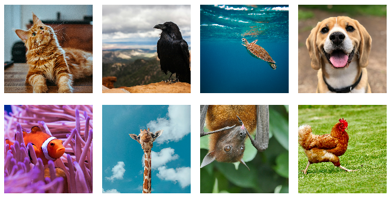

# Cvičení: Boostrap JavaScript

Oživ galerii pomocí knihovny [Lightbox](https://lokeshdhakar.com/projects/lightbox2/).



## Zadání

1. Zapoj knihovnu Lightbox. Stahovat ji nemusíš. Máš ji v repozitáři předpřipravenou ve složce `lightbox2`.

   1. Přidej do hlavičky stránky odkaz na CSS soubor knihovny.

      ```html
      <link href="lightbox2/css/lightbox.min.css" rel="stylesheet" />
      ```

   1. Před zavírací značku `</body>` přidej odkaz na skript.

      ```html
      <script src="lightbox2/js/lightbox-plus-jquery.min.js"></script>
      ```

   1. Jestli se povedlo soubory správě napojit se ukáže později.

1. Přidej všem osmi odkazům, co obalují obrázky, atribut `data-lightbox="galerie"`.

1. Vyzkoušej, že galerie funguje.

## Bonus

Přidej obrázkům miniatury, aby se uživatelům nestahovaly obrázky hned v plné kvalitě, ještě než je zvětší.



1.  Ořízni všechny obrázky na čtverce `150`x`150` pixelů a přidej je do složky mezi ostatní.

1.  V HTML uprav `src` atributy na nové, zmenšené obrázky. Například:

    ```html
    <a data-lightbox="galerie" href="podklady/zelva.jpg">
    	
    </a>
    ```
